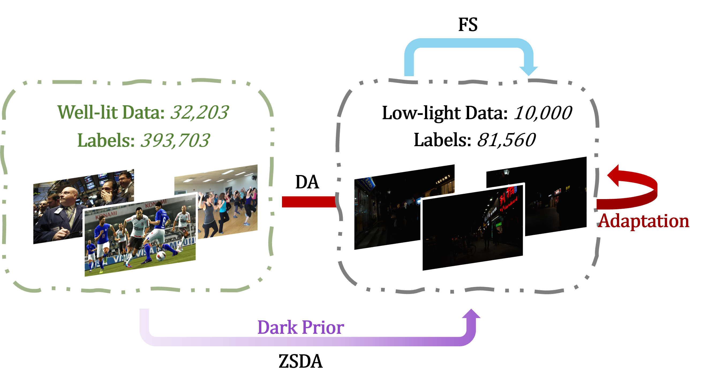
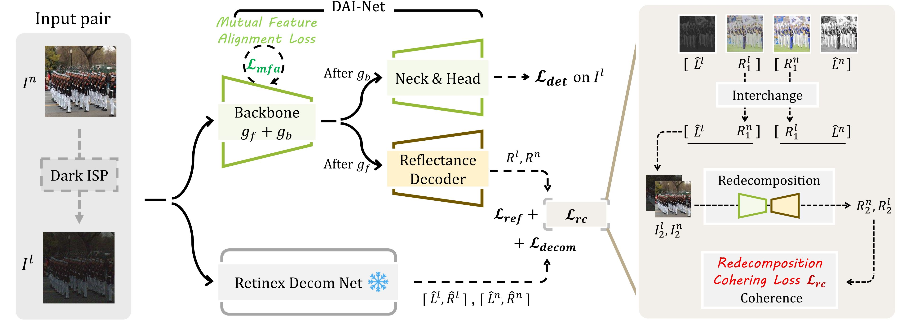
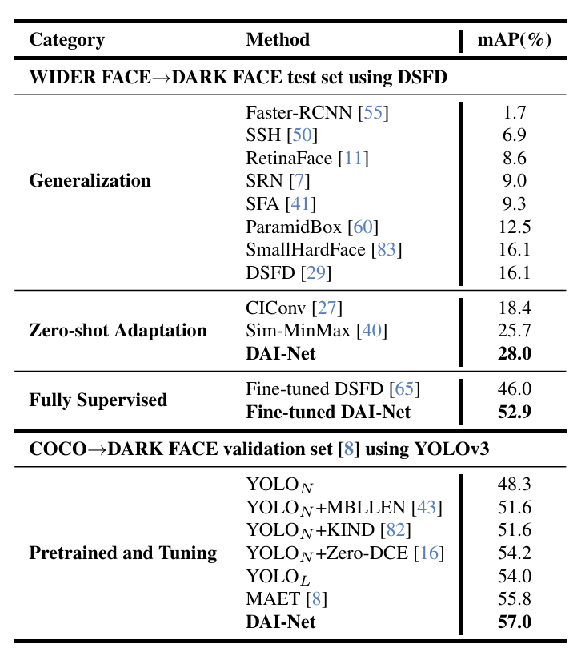
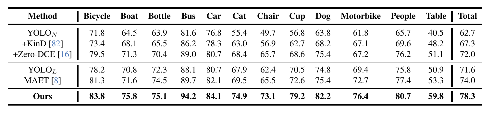
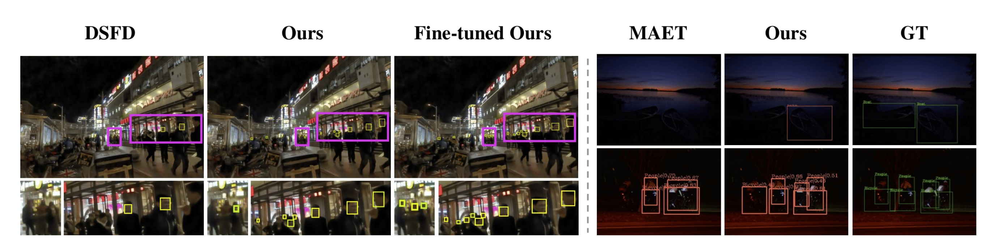
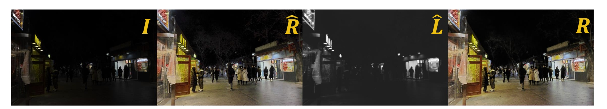

# Task Formulation

 Different from prior fully-/semi-supervised low-light detection paradigms, we work in a novel setting called **Zero-Shot Day-Night Domain Adaptation** (ZSDA).
 During training, we only have access to the well-lit images. Then, the trained model is directly evaluated on low-light images.

<center> 
</center>

# Overview

  During training, our pipeline takes only well-lit images as input, and learns low-light object detection.
  Given the synthesized well-lit/low-light image pairs and their corresponding image decomposition pseudo GT,
  our <strong>DAI-Net</strong> learns to predict reflectance maps through a reflectance decoder, therefore encoding
  illumination-invariant information into its base detector. Moreover, we further reinforce the
  reflectance representation with a mutual feature alignment loss and an interchange-redecomposition-coherence procedure.

 

# Results

Experimental Setting: Source dataset (train) -> Target dataset (target)

### Face Detection

<font size=3>Wider Face / COCO -> Dark Face</font>
<center></center>
### Object Detection

<font size=3>COCO -> ExDark</font>


### Visualization

<font size=3>Detection results on Dark Face and ExDark</font>


<font size=3>Visualization of original image, pseudo ground truth, and predicted reflectance</font>

# Citation

```
@inproceedings{du2024boosting,
  title={Boosting Object Detection with Zero-Shot Day-Night Domain Adaptation},
  author={Du, Zhipeng and Shi, Miaojing and Deng, Jiankang},
  booktitle={Proceedings of the IEEE/CVF Conference on Computer Vision and Pattern Recognition},
  pages={12666--12676},
  year={2024}
}
```
or
```
@article{du2023boosting,
  title={Boosting Object Detection with Zero-Shot Day-Night Domain Adaptation},
  author={Du, Zhipeng and Shi, Miaojing and Deng, Jiankang},
  journal={arXiv preprint arXiv:2312.01220},
  year={2023}
}
```
